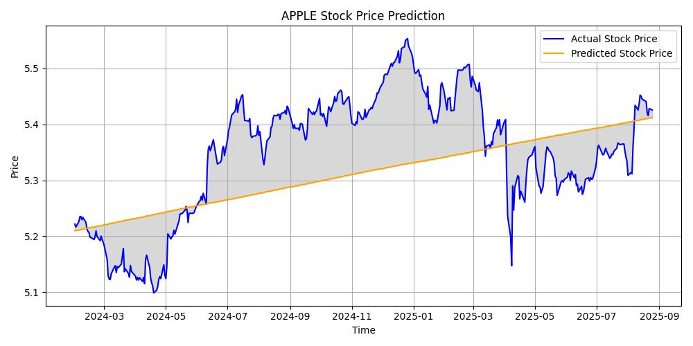
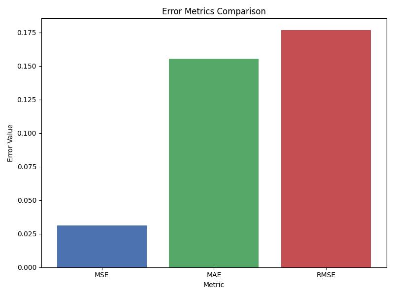
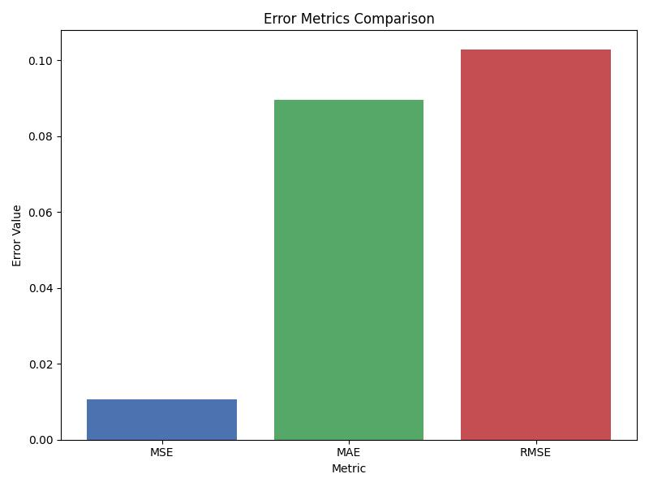

# AAPL-Forecast

<div style="text-align: center;">
  
  
  
  
  
  
  
  
  
</div>

## 📈 Overview

AAPL-Forecast is an end-to-end stock price prediction system that leverages machine learning (Linear Regression) and statistical modeling (ARIMA) to forecast Apple Inc. (AAPL) stock prices. The system is built to fetch historical financial data via the yFinance library, perform comprehensive analysis, and generate accurate price predictions.

This project demonstrates how different forecasting approaches can be applied to financial time series data, providing insights into stock price movements and potential future trends.


Linear Regression Forecast vs Actual Prices


ARIMA Forecast vs Actual Prices

## 🚀 Features

- **Real-time Data Fetching**: Retrieves historical stock data using yFinance API
- **Comprehensive EDA**: Visualizes trends, moving averages, and tests for stationarity
- **Dual Modeling Approach**:
  - ARIMA (AutoRegressive Integrated Moving Average) for time series forecasting
  - Linear Regression for trend-based prediction
- **Model Evaluation**: Compares models using RMSE, MAE, and MSE metrics
- **Visualization**: Clear graphical representation of predictions vs. actual prices
- **Scalable Design**: Architecture allows for adding more prediction models

## 📋 Installation

### Prerequisites

- Python 3.7+
- Git

### Setup Instructions

1. Clone the repository:

   ```bash
   git clone https://github.com/Lucky-Langa/AAPL-Forecast-.git
   cd AAPL-Forecast-
   ```

2. Install required dependencies:
   ```bash
   pip install -r requirements.txt
   ```

## 💻 Usage

The project workflow consists of several key steps:

### 1. Data Fetching

The system automatically fetches AAPL stock price data using the yFinance library.

```python
import yfinance as yf

# Fetch Apple stock data
aapl = yf.Ticker('AAPL')
start_date = '2010-01-01'
end_date = datetime.now().strftime('%Y-%m-%d')
aapl_history = aapl.history(start=start_date, end=end_date)
```

### 2. Exploratory Data Analysis

Analyze the data to understand trends, seasonality, and stationarity.

```python
# Example: Plotting closing prices
import matplotlib.pyplot as plt

plt.figure(figsize=(12, 6))
plt.plot(aapl_data['Close'])
plt.title('AAPL Closing Price History')
plt.xlabel('Date')
plt.ylabel('Price (USD)')
plt.grid(True)
plt.show()
```

### 3. Model Training and Testing

Train both ARIMA and Linear Regression models on the historical data.

### 4. Evaluation and Comparison

Compare model performance using standard metrics.

### 5. Running the Complete Analysis

To run the full analysis, open and execute the Jupyter notebook:

```bash
jupyter notebook main.ipynb
```

## 📊 Results

The project compares the performance of ARIMA and Linear Regression models for stock price prediction:

| Model             | RMSE                  | MAE                   | MSE                    | MAPE      |
| ----------------- | --------------------- | --------------------- | ---------------------- | --------- |
| ARIMA             | _0.17666569792143005_ | _0.15548665678153178_ | _0.031210768822065974_ | _2.8795%_ |
| Linear Regression | _0.0106_              | _0.0896_              | _0.1027_               | _1.6675%_ |


Arima metrics

LinearRegression metrics

## 🔮 Upcoming Features

- **Additional ML Models**: Implementation of more advanced models like LSTM and Prophet
- **Automated Retraining**: System to automatically retrain models with new data

## 🤝 Contributing

Contributions are welcome! Here's how you can contribute:

1. Fork the repository
2. Create your feature branch:
   ```bash
   git checkout -b feature/amazing-feature
   ```
3. Commit your changes:
   ```bash
   git commit -m 'Add some amazing feature'
   ```
4. Push to the branch:
   ```bash
   git push origin feature/amazing-feature
   ```
5. Open a Pull Request

Please ensure your code follows the project's coding standards and includes appropriate tests.

## 📄 License

This project is licensed under the MIT License - see the [LICENSE](LICENSE) file for details.

## 📬 Contact

Lucky Langa - Langatshepiso77@gmail.com

Project Link: [https://github.com/Lucky-Langa/AAPL-Forecast-](https://github.com/Lucky-Langa/AAPL-Forecast-)

---

<p align="center">
  <i>If you found this project helpful, please consider giving it a ⭐!</i>
</p>
